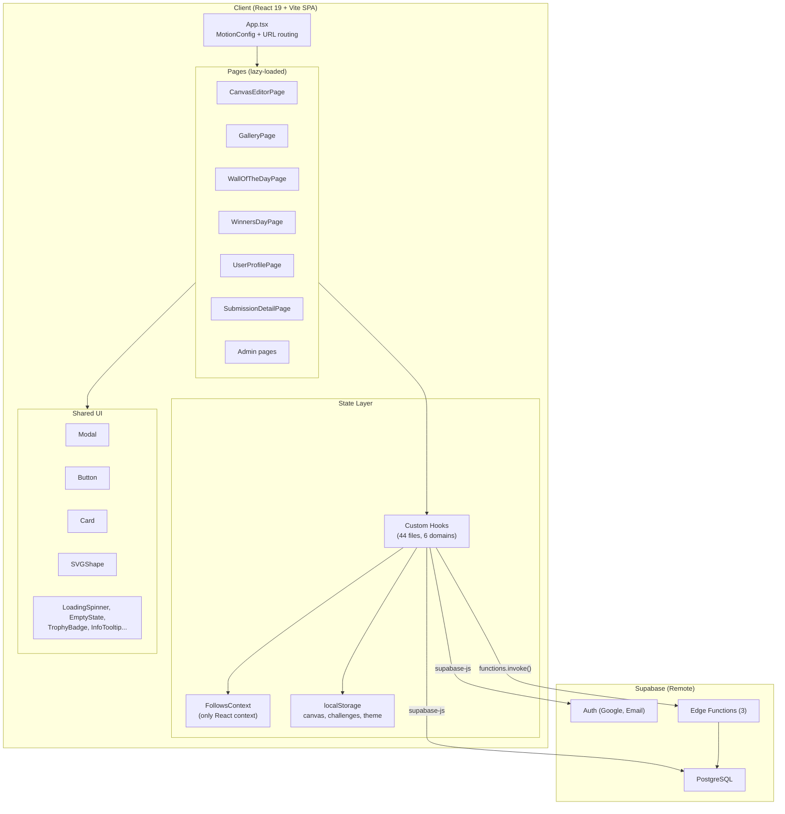
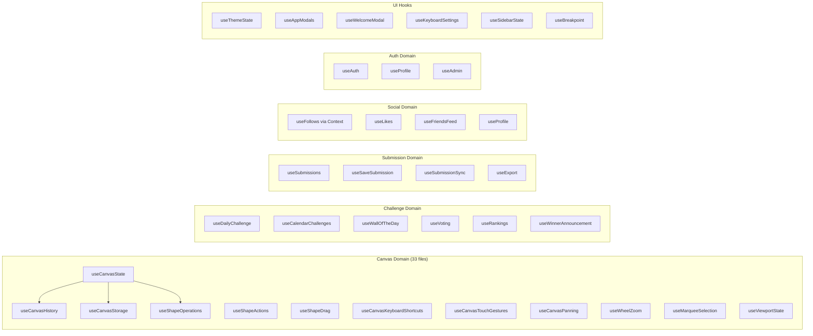
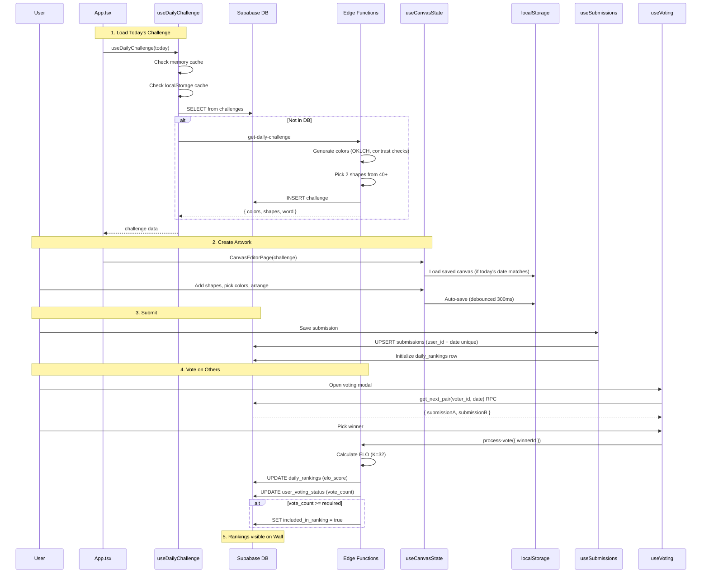
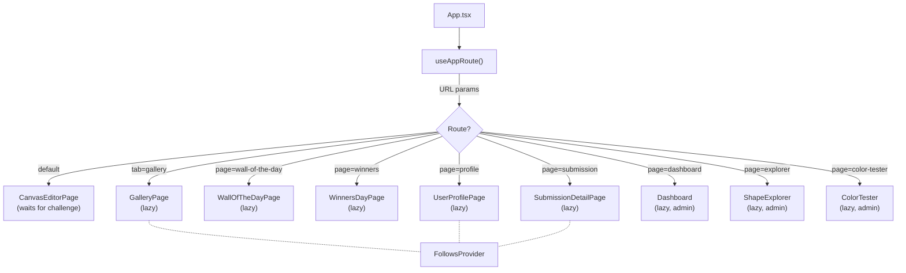
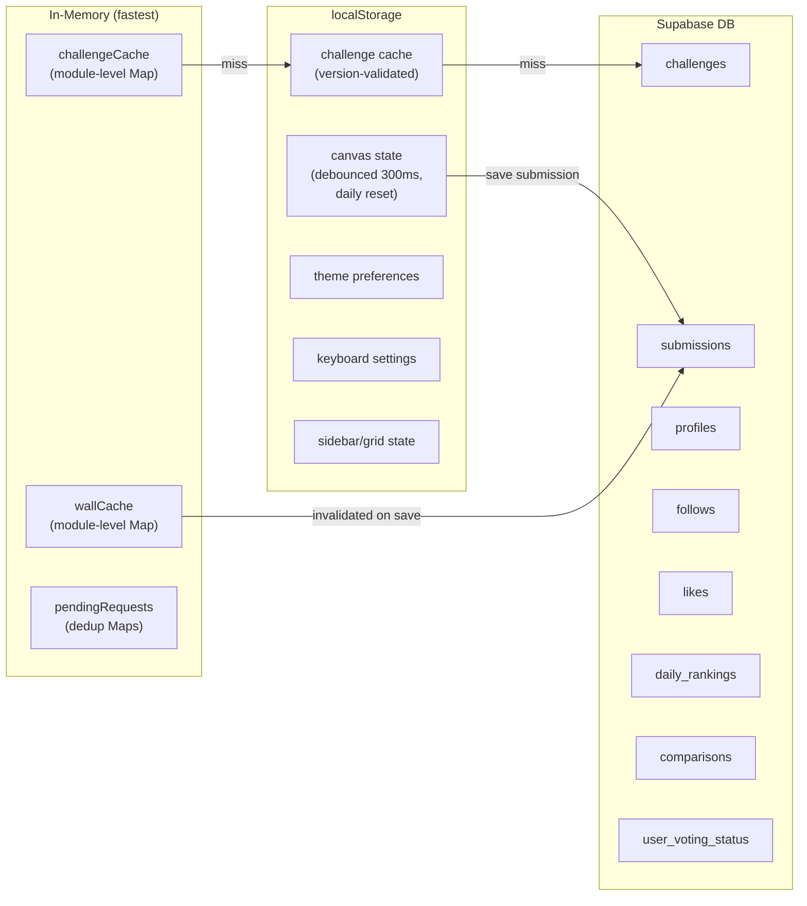
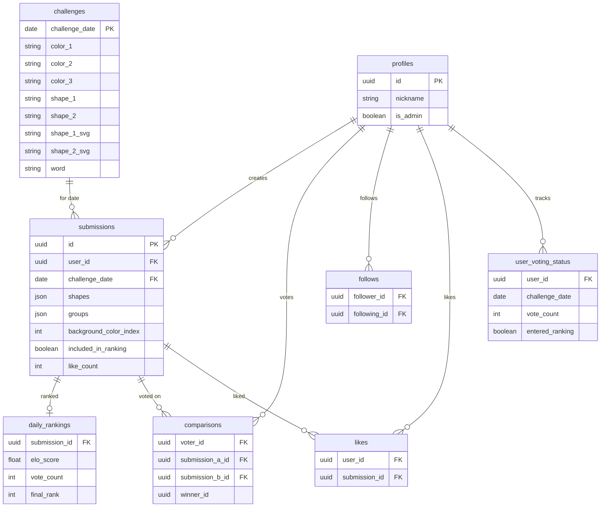

# Architecture Diagrams: 2 Colors 2 Shapes

> Auto-generated architecture visualization. Re-generate by asking Claude to update this file.

## 1. High-Level System Architecture

## 2. Feature Domains & Hook Map

## 3. Core Data Flow: Challenge → Create → Submit → Vote → Rank

## 4. Canvas Editor Component Tree

```mermaid
graph TB
    CEP["CanvasEditorPage"]

    CEP --> TB["TopBar"]
    CEP --> C["Canvas (SVG)"]
    CEP --> LP["LayerPanel"]
    CEP --> TP["ToolsPanel"]
    CEP --> BT["BottomToolbar"]
    CEP --> ZC["ZoomControls"]
    CEP --> KSP["KeyboardShortcutsPopover"]
    CEP --> Modals

    TB --> IC["InspirationCenter<br/>(daily word)"]
    TB --> ThP["ThemePill"]
    TB --> UMD["UserMenuDropdown"]

    C --> GL["CanvasGridLines"]
    C --> SE["ShapeElement[]"]
    C --> TIL["TransformInteractionLayer"]
    C --> MSTL["MultiSelectTransformLayer"]
    C --> HHL["HoverHighlightLayer"]
    C --> TCM["TouchContextMenu"]

    LP --> LI["LayerItem[]"]

    BT --> ShapePicker["Shape buttons"]
    BT --> ColorSwatch["Color swatches"]

    subgraph Modals
        WM["WelcomeModal"]
        OM["OnboardingModal"]
        VM["VotingModal"]
        FM["FriendsModal"]
        KSM["KeyboardSettingsModal"]
        RCM["ResetConfirmModal"]
        WAM["WinnerAnnouncementModal"]
        CM["CongratulatoryModal"]
    end

    VM --> VPV["VotingPairView"]
    VM --> VPr["VotingProgress"]
    VM --> VC["VotingConfirmation"]
```

## 5. Page Routing & Code Splitting

## 6. Persistence & Caching Strategy

## 7. Database Schema (Key Tables)

