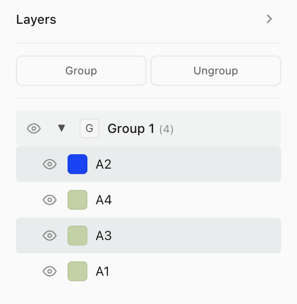
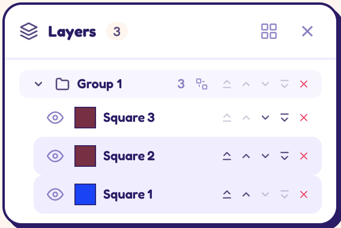

- there's an issue with group behaviour. you're not able to take a few layers out of a group. there are only buttons to disband the group altogether. in the solution in the main branch there was an "ungroup" button which did just that. so we need to a) add that feature back and b) figure out how best to do this with the current design that doesn't have the overt "group" and "ungroup" buttons. Maybe a context aware button to ungroup? main branch:  , current branch: 